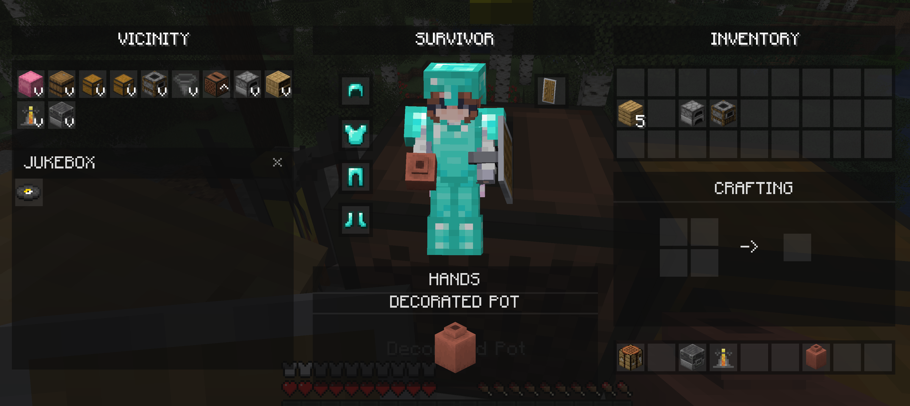

# DayZ Inventory

[中文](README.md) | **English**

[](https://modrinth.com/mod/dayz-inventory)
[](https://www.curseforge.com/minecraft/mc-mods/dayz-inventory)
[](https://modrinth.com/mod/dayz-inventory/versions)
[](https://modrinth.com/mod/dayz-inventory)
[](https://www.curseforge.com/minecraft/mc-mods/dayz-inventory)
[](LICENSE)
[](https://ko-fi.com/suoim)

A complete overhaul of the Minecraft inventory UI, bringing the look, feel, and mechanics of the
DayZ inventory system into Minecraft: a **Vicinity** grid of nearby ground items and containers, a
dynamic **Hands** attachment slot bound to the active hotbar slot, an integrated **2x2 crafting
grid**, and drag-to-equip onto the **Survivor** panel.

**Really recommended with [DayZ Hotbar](https://modrinth.com/mod/dayz-hotbar)** — seamless
integration. The two are built as a pair, so the HUD and the inventory screen share one look.

## Supported versions and loaders

| Minecraft | Fabric | NeoForge | Forge | Java |
| :--- | :---: | :---: | :---: | :---: |
| **1.20.1** | ✅ | — | — | 17 |
| **1.20.2** | ✅ | — | — | 17 |
| **1.20.3** | ✅ | — | — | 17 |
| **1.20.4** | ✅ | — | — | 17 |
| **1.20.5** | ✅ | — | — | 21 |
| **1.20.6** | ✅ | ✅ | ✅ | 21 |
| **1.21** | ✅ | ✅ | ✅ | 21 |
| **1.21.1** | ✅ | ✅ | ✅ | 21 |
| **1.21.2** | ✅ | ✅ | — | 21 |
| **1.21.3** | ✅ | ✅ | ✅ | 21 |
| **1.21.4** | ✅ | ✅ | ✅ | 21 |
| **1.21.5** | ✅ | ✅ | ✅ | 21 |
| **1.21.6** | ✅ | ✅ | ✅ | 21 |
| **1.21.7** | ✅ | ✅ | ✅ | 21 |
| **1.21.8** | ✅ | ✅ | ✅ | 21 |
| **1.21.9** | ✅ | ✅ | ✅ | 21 |
| **1.21.10** | ✅ | ✅ | ✅ | 21 |
| **1.21.11** | ✅ | ✅ | ✅ | 21 |
| **26.1** | ✅ | ✅ | — | 25 |
| **26.1.1** | ✅ | ✅ | — | 25 |
| **26.1.2** | ✅ | ✅ | — | 25 |
| **26.2** | ✅ | ✅ | — | 25 |
| **26.3** | ✅ | ✅ | — | 25 |

That is **23 Minecraft versions and 53 shippable jars**: 23 Fabric, 18 NeoForge and 12 Forge. Fabric
and NeoForge cover every version from 1.20.6 upward. The only holes in the matrix are these:

- **1.20.1–1.20.4** are Fabric only. 1.20.1 predates NeoForge entirely; NeoForge's 1.20.2 release still uses the old `SimpleChannel` networking stack; 1.20.3 had no NeoForge release at all; and 1.20.4's payload API arrived before `StreamCodec` existed, so it would need a payload type of its own. Forge 1.20.1 additionally needs SRG reobfuscation and a Searge mixin refmap, which the current Forge toolchain cannot produce.
- **1.20.5** is Fabric only: NeoForge published that release without the metadata the build needs, and Forge has no 1.20.5 release.
- **1.21.2** has no Forge build because Forge skipped that release.
- **26.x has no Forge build**: Forge's 26.x line is not a target this mod builds for; NeoForge is the supported route there.

Every artifact is built from **one source tree**: [Stonecutter](https://stonecutter.kikugie.dev/)
handles multi-version preprocessing and the `common/` + per-loader modules handle loader
abstraction. The matrix is declared in `settings.gradle.kts`; adding a version is one line there plus
a `versions/<mc>/gradle.properties` file.



---

## Features

### Unified Vicinity Grid and Expandable Drawers
- **Proximity Scanner**: rescans every 10 ticks for ground items and container blocks (chests,
  barrels, shulker boxes) within a 3-block radius.
- **Unified Column**: nearby ground items and storage blocks share one scrollable grid under the
  VICINITY header.
- **Container Selectors**: containers are drawn as slot icons with coordinate and distance tooltips.
- **Inline Drawer Grids**: clicking a container selector expands its slots inline, below the grid.

### Dynamic Hands Attachment Slot
- **Active Hotbar Binding**: mirrors whichever hotbar slot is currently selected.
- **Large Attachment Slot**: a fully translucent panel body in place of the default slot.
- **Double-Scaled Render**: the held item is drawn at **2.0x** (32x32 px) centred in the panel.
- **Capitalised Name Banner**: shows the item name (e.g. `HUNTING KNIFE`) under the header.

### Crafting and Equipment Swapping
- **Vanilla 2x2 Grid**: the crafting grid and result slot live inside the custom screen; the result
  is recomputed server-side.
- **Drag-to-Equip**: drag armour or clothing onto the middle Survivor panel to equip or swap it.

### Optional Mod Integration
- **Recipe Viewers (JEI / REI / EMI)**: a theme-aligned toggle button in the header, drawn only when
  a supported viewer is installed.
- **Curios API**: adds a CURIOS button to the Survivor header.
- **Trinkets**: adds a TRINKETS button to the Survivor header.

Every integration is probed at runtime with `isModLoaded`. The mod launches, opens its screen and
works fully with **none** of them installed.

---

## Installation

1. As long as your Minecraft version is in the matrix above you are covered: **Fabric** spans all
   23 versions, **NeoForge** from 1.20.6 upward, and **Forge** from 1.20.6 to 1.21.11.
2. Download the file whose name matches your Minecraft version *and* loader from
   [Modrinth](https://modrinth.com/mod/dayz-inventory/versions) or
   [CurseForge](https://www.curseforge.com/minecraft/mc-mods/dayz-inventory/files).
3. Drop it into `mods/`.

> **Pick carefully.** A Fabric build will not load on Forge or NeoForge, a NeoForge build will not
> load on Forge, and builds for different Minecraft versions are not interchangeable. Each filename
> carries its Minecraft version and loader.

## Dependencies

| Minecraft | Loader | Java | Required | Optional |
| :--- | :--- | :---: | :--- | :--- |
| **1.20.1** | Fabric | 17 | Fabric Loader `>=0.16.14`, Fabric API `0.92.12+1.20.1` | JEI / REI / EMI, Trinkets (Fabric), Curios |
| **1.20.2** | Fabric | 17 | Fabric Loader `>=0.16.14`, Fabric API `0.91.6+1.20.2` | JEI / REI / EMI, Trinkets (Fabric), Curios |
| **1.20.3** | Fabric | 17 | Fabric Loader `>=0.16.14`, Fabric API `0.91.1+1.20.3` | JEI / REI / EMI, Trinkets (Fabric), Curios |
| **1.20.4** | Fabric | 17 | Fabric Loader `>=0.16.14`, Fabric API `0.97.3+1.20.4` | JEI / REI / EMI, Trinkets (Fabric), Curios |
| **1.20.5** | Fabric | 21 | Fabric Loader `>=0.16.14`, Fabric API `0.97.8+1.20.5` | JEI / REI / EMI, Trinkets (Fabric), Curios |
| **1.20.6** | Fabric / NeoForge / Forge | 21 | Fabric Loader `>=0.16.14`, Fabric API `0.100.8+1.20.6`; NeoForge `20.6.141`; Forge `50.2.10` | JEI / REI / EMI, Trinkets (Fabric), Curios |
| **1.21** | Fabric / NeoForge / Forge | 21 | Fabric Loader `>=0.16.14`, Fabric API `0.102.0+1.21`; NeoForge `21.0.167`; Forge `51.0.33` | JEI / REI / EMI, Trinkets (Fabric), Curios |
| **1.21.1** | Fabric / NeoForge / Forge | 21 | Fabric Loader `>=0.16.14`, Fabric API `0.116.17+1.21.1`; NeoForge `21.1.250`; Forge `52.1.12` | JEI / REI / EMI, Trinkets (Fabric), Curios |
| **1.21.2** | Fabric / NeoForge | 21 | Fabric Loader `>=0.16.14`, Fabric API `0.106.1+1.21.2`; NeoForge `21.2.1-beta` | JEI / REI / EMI, Trinkets (Fabric), Curios |
| **1.21.3** | Fabric / NeoForge / Forge | 21 | Fabric Loader `>=0.16.14`, Fabric API `0.114.1+1.21.3`; NeoForge `21.3.97`; Forge `53.1.12` | JEI / REI / EMI, Trinkets (Fabric), Curios |
| **1.21.4** | Fabric / NeoForge / Forge | 21 | Fabric Loader `>=0.16.14`, Fabric API `0.119.4+1.21.4`; NeoForge `21.4.157`; Forge `54.1.18` | JEI / REI / EMI, Trinkets (Fabric), Curios |
| **1.21.5** | Fabric / NeoForge / Forge | 21 | Fabric Loader `>=0.19.5`, Fabric API `0.128.2+1.21.5`; NeoForge `21.5.98`; Forge `55.1.13` | JEI / REI / EMI, Trinkets (Fabric), Curios |
| **1.21.6** | Fabric / NeoForge / Forge | 21 | Fabric Loader `>=0.19.5`, Fabric API `0.128.2+1.21.6`; NeoForge `21.6.20-beta`; Forge `56.0.9` | JEI / REI / EMI, Trinkets (Fabric), Curios |
| **1.21.7** | Fabric / NeoForge / Forge | 21 | Fabric Loader `>=0.19.5`, Fabric API `0.129.0+1.21.7`; NeoForge `21.7.25-beta`; Forge `57.0.3` | JEI / REI / EMI, Trinkets (Fabric), Curios |
| **1.21.8** | Fabric / NeoForge / Forge | 21 | Fabric Loader `>=0.19.5`, Fabric API `0.136.1+1.21.8`; NeoForge `21.8.54`; Forge `58.1.22` | JEI / REI / EMI, Trinkets (Fabric), Curios |
| **1.21.9** | Fabric / NeoForge / Forge | 21 | Fabric Loader `>=0.19.5`, Fabric API `0.134.1+1.21.9`; NeoForge `21.9.16-beta`; Forge `59.0.5` | JEI / REI / EMI, Trinkets (Fabric), Curios |
| **1.21.10** | Fabric / NeoForge / Forge | 21 | Fabric Loader `>=0.19.5`, Fabric API `0.138.4+1.21.10`; NeoForge `21.10.64`; Forge `60.1.15` | JEI / REI / EMI, Trinkets (Fabric), Curios |
| **1.21.11** | Fabric / NeoForge / Forge | 21 | Fabric Loader `>=0.19.5`, Fabric API `0.141.6+1.21.11`; NeoForge `21.11.45`; Forge `61.2.1` | JEI / REI / EMI, Trinkets (Fabric), Curios |
| **26.1** | Fabric / NeoForge | 25 | Fabric Loader `>=0.19.5`, Fabric API `0.145.1+26.1`; NeoForge `26.1.0.19-beta` | JEI / REI / EMI, Trinkets (Fabric), Curios |
| **26.1.1** | Fabric / NeoForge | 25 | Fabric Loader `>=0.19.5`, Fabric API `0.145.4+26.1.1`; NeoForge `26.1.1.15-beta` | JEI / REI / EMI, Trinkets (Fabric), Curios |
| **26.1.2** | Fabric / NeoForge | 25 | Fabric Loader `>=0.19.5`, Fabric API `0.155.3+26.1.2`; NeoForge `26.1.2.109` | JEI / REI / EMI, Trinkets (Fabric), Curios |
| **26.2** | Fabric / NeoForge | 25 | Fabric Loader `>=0.19.5`, Fabric API `0.160.0+26.2`; NeoForge `26.2.0.88` | JEI / REI / EMI, Trinkets (Fabric), Curios |
| **26.3** | Fabric / NeoForge | 25 | Fabric Loader `>=0.19.5`, Fabric API `0.160.6+26.3`; NeoForge `26.3.0.1-beta` | JEI / REI / EMI, Trinkets (Fabric), Curios |

Optional entries are probed at runtime — the mod never requires them and will not crash without
them. Trinkets is Fabric only; on NeoForge and Forge the role is filled by Curios.

---

## Building from source

The Gradle launcher needs **JDK 25**. The Java 17 / 21 toolchains the rest of the matrix needs are
downloaded automatically by the foojay resolver, so nothing has to be installed by hand.

```bash
# Builds every Minecraft version x every mod loader in the matrix.
./gradlew chiseledBuild

# A single target (artifacts land in <loader>/versions/<mc>/build/libs/).
./gradlew :fabric:26.2:build
./gradlew :neoforge:1.21.11:build
./gradlew :forge:1.21.11:build

# List every node in the matrix.
./gradlew matrix
```

Artifacts are named `dayz-inventory-<loader>-<minecraft>-<mod version>.jar`, for example
`dayz-inventory-fabric-26.2-1.8.0+mc26.2.jar`. The Minecraft version is part of the filename on
purpose: the same mod version ships for several game versions, and CurseForge rejects a second file
whose display name collides inside a project.

Architecture, the conditional-compilation conventions and how to add a version are documented in
**[docs/BUILDING.en.md](docs/BUILDING.en.md)**.

### Publishing to CurseForge and Modrinth

```bash
MODRINTH_TOKEN=... CURSEFORGE_API_KEY=... \
  ./gradlew publishAll -Ppublish.dry_run=false
```

- Every node is tagged with **its own** game version and loader, taken from
  `versions/<mc>/gradle.properties`, so a jar cannot be uploaded under the wrong Minecraft version.
- `publish.dry_run` defaults to `true`; without turning it off, `publishMods` only logs.
- **CurseForge publishes are fire-and-forget.** Every file goes through human review and the API
  accepts it without returning a URL, so a green CurseForge task means "submitted", not "live".
- One platform at a time: `:fabric:26.2:publishModrinth` / `:fabric:26.2:publishCurseforge`.

CI (`.github/workflows/build.yml`) builds the whole matrix on a `v*` tag, attaches every jar to the
GitHub Release and publishes to both platforms.

## Versioning

`mod.version` in `gradle.properties` is the single source of truth. It is expanded into
`fabric.mod.json`, `neoforge.mods.toml`, `mods.toml` and `pack.mcmeta`. Bump it, then update
[CHANGELOG.md](CHANGELOG.md).

## License

Apache License 2.0 — see [LICENSE](LICENSE).
